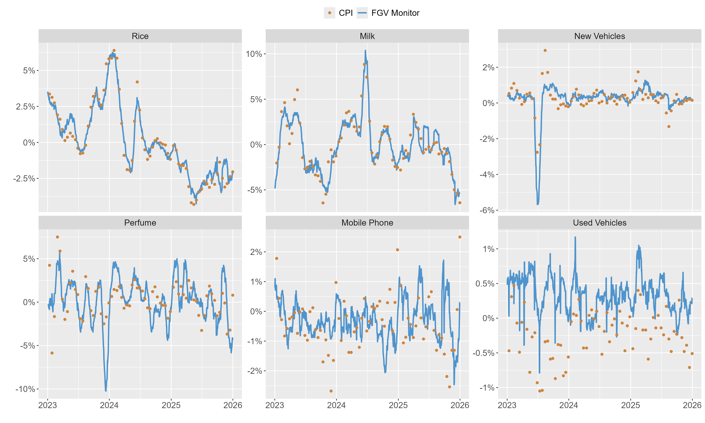
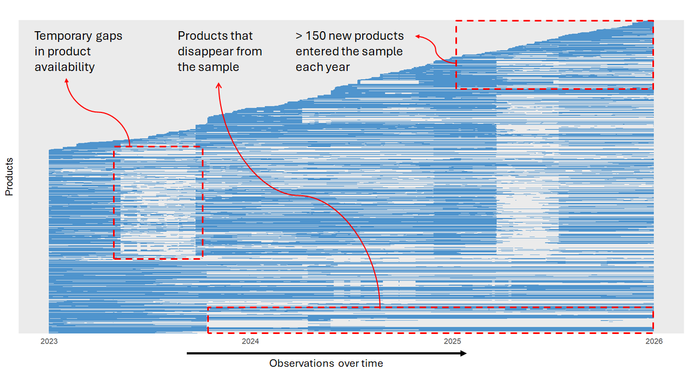
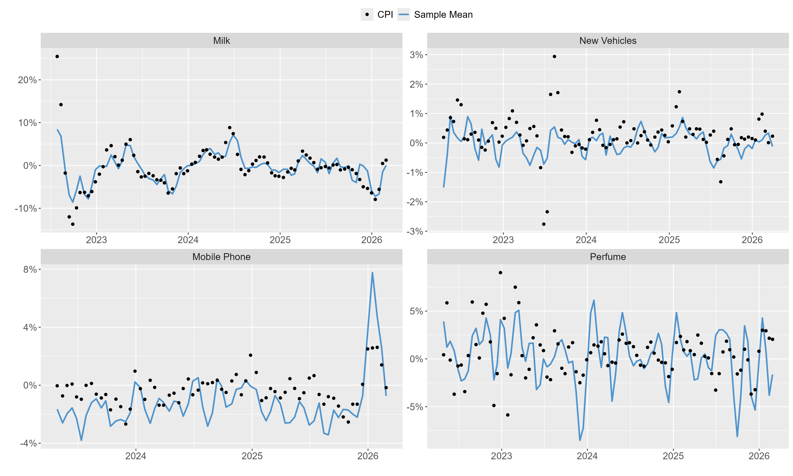
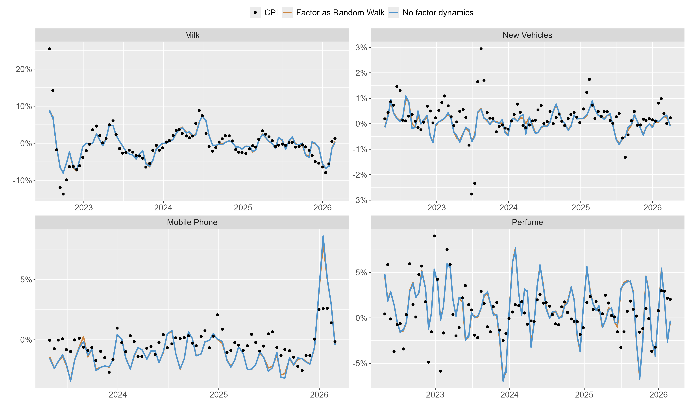
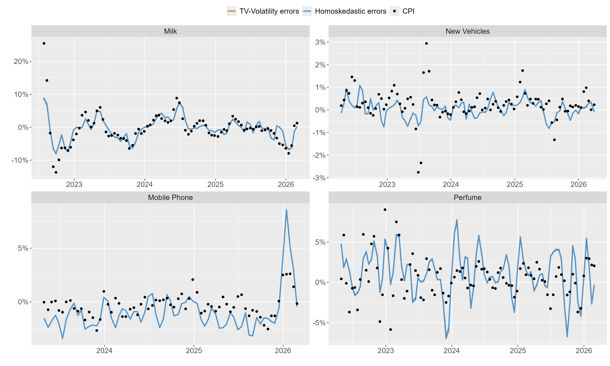
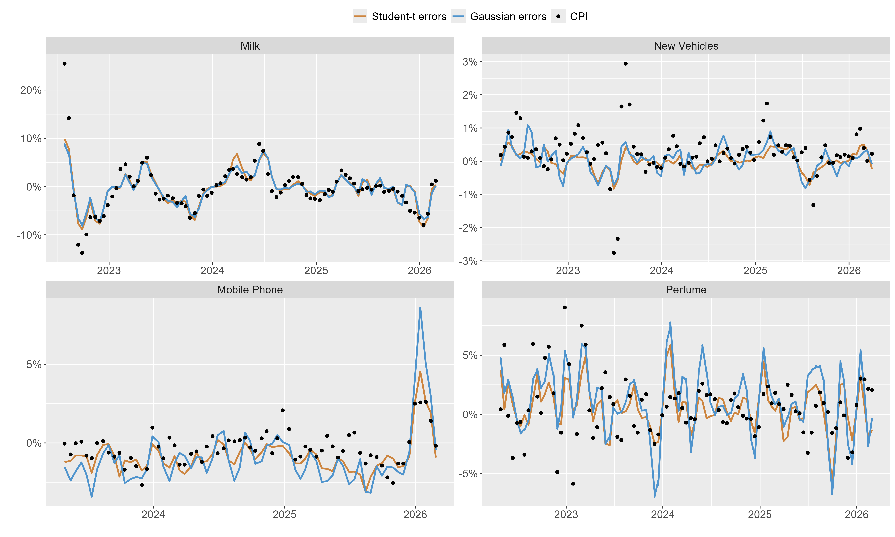
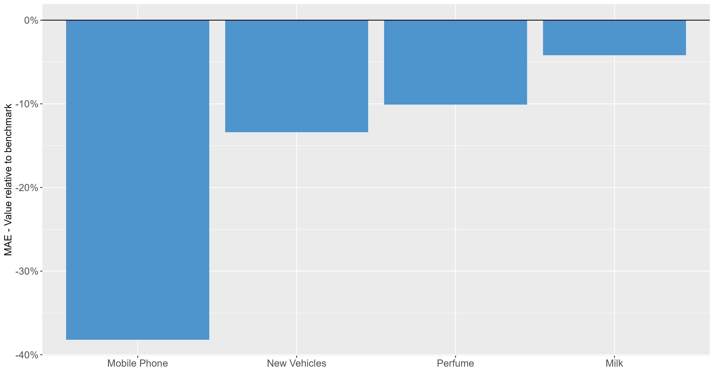
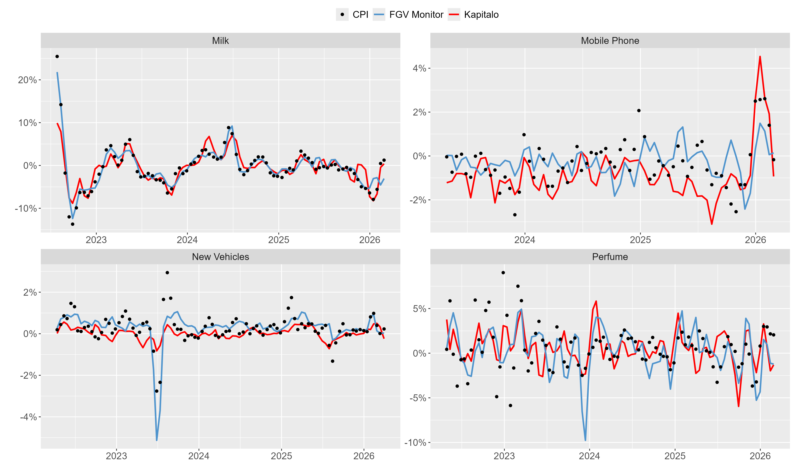
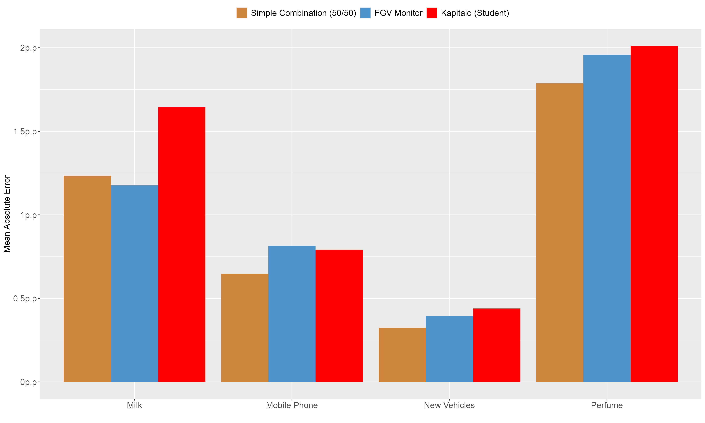

## About me

-  Economist with a background in macroeconomic forecasting and data science

- Lead of Data and Economic Modeling at Kapitalo Investimentos, a Brazilian multi-manager hedge fund with over USD 5 billion in assets under management

- My work involves forecasting, quantitative research, and the development of production data pipelines

- I am particularly interested in alternative data and research engineering

## What Led Me to This Problem?
### Forecasting inflation in Brazil is a highly competitive task

- Inflation forecasts are central to asset allocation in Brazil

- A deep and liquid market for inflation-linked bonds creates strong incentives to forecast inflation accurately

- Public information is rapidly incorporated into prices by highly qualified forecasters

  - These include commodity prices, exchange rates, wholesale prices, among many others

- In addition, professional forecasters closely monitor a proprietary indicator known as the FGV Monitor
  
  - The FGV Monitor tracks prices from brick-and-mortar stores and closely mirrors the methodology of Brazil's official statistical agency, providing an early and informative signal of short-term inflation 

## Predictive Performance Varies Across CPI Components
### While the FGV Monitor is difficult to outperform for some components, its predictive power is more limited for others

{fig-align="center"}

## Where can we seek additional information?
### Finding an edge increasingly requires alternative data

- Rather than replacing the FGV Monitor, we seek to add an extra indicator, particularly for components where its predictive performance is more limited

- Recent advances in computational tools have significantly lowered the barriers to collecting alternative data

- But even when market participants collect similar sources, differences in coverage, cleaning, classification, and modeling often lead to very different indicators

 The challenge is no longer access to data, but how to transform it into useful signals 

## What Inputs Do We Have?
### A large set of related products

- Web-scraped product-level prices

- The number of available products is much larger than the official CPI basket

- The CPI basket should be a subset of this data

This looks like a standard variable selection problem, right?

## Not Quite a Selection Problem
### The product basket changes continuously

- Products continuously enter and leave the basket

- Electronics have short lifecycles and are constantly replaced

- Vehicles are effectively a new basket every year

- Even "stable" categories exhibit gradual turnover

The set of relevant products is itself a moving target

## What Does Turnover Look Like?
### Product availability over time

{fig-align="center"}

## Why Do Standard Approaches Struggle?
### High turnover creates methodological and operational challenges

- Most methods are designed to learn stable relationships from a fixed set of predictors

- Many products have short lifecycles, leaving little time to estimate, validate, and re-optimize models before the underlying cross-section changes again

- In production environments, daily pipelines benefit from methods that remain stable over time rather than requiring frequent re-specification

 The challenge is not only statistical. It is also operational. 

## Reframing the Task
### From selecting products to aggregating information

- Variable selection relies on learning stable relationships over time

- Most products in our data have short and irregular histories

- The cross-section is rich, but the time dimension is scarce

Instead of asking which products matter, we ask how to best aggregate the information they contain

## A Simple Benchmark
### Despite its simplicity, the mean captures a useful amount of information

{fig-align="center"}

## A Structured Approach
### From a Mean to a Factor Model

- The mean already captures a useful amount of information

- Rather than replacing it, we can view it as a very restricted factor model

- This perspective suggests a natural path for introducing additional structure

A factor model allows us to extend the mean while preserving its intuition

## The Mean as the Simplest Factor Model
### A single latent factor under strong restrictions

- Unit loadings, no factor dynamics, and homoskedastic Gaussian errors

$$
\require{cancel}
\begin{aligned}
y_{i,t} &= f_t + \varepsilon_{i,t} \\
f_t &= \eta_t \\
\varepsilon_{i,t} &\sim {\mathcal{N}}(0, {\sigma_\varepsilon}) \\
\eta_t &\sim \mathcal{N}(0, \sigma_\eta)
\end{aligned}
$$

This naturally leads to potential extensions.

## Extension 1: Factor Dynamics
###  Allow the latent signal to evolve over time 

$$
\require{cancel}
\begin{aligned}
y_{i,t} &=  f_t + \varepsilon_{i,t} \\
f_t &= \color{#D97706}{f_{t-1}} + \eta_t \\
\varepsilon_{i,t} &\sim \mathcal{N}(0, {\sigma_\varepsilon}) \\
\eta_t &\sim \mathcal{N}(0, \sigma_\eta)
\end{aligned}
$$

## Extension 1: Factor Dynamics
###  Allow the latent signal to evolve over time 

{fig-align="center"}

## Extension 2: Time-Varying Volatility
###  Measurement uncertainty changes with cross-sectional dispersion 

$$
\require{cancel}
\begin{aligned}
y_{i,t} &=  f_t + \varepsilon_{i,t} \\
f_t &= \eta_t \\
\varepsilon_{i,t} &\sim \mathcal{N}(0, \color{#D97706}{\sigma_{\varepsilon,t}}) \\
\color{#D97706}{\log(\sigma_{\varepsilon,t})} &\color{#D97706}{=} \color{#D97706}{\alpha + \beta \times IQR_t} \\
\eta_t &\sim \mathcal{N}(0, \sigma_\eta)
\end{aligned}
$$

## Extension 2: Time-Varying Volatility
###  Measurement uncertainty changes with cross-sectional dispersion 

{fig-align="center"}

## Extension 3: Student-t Errors
###  Robustness to extreme product-level price changes 

$$
\require{cancel}
\begin{aligned}
y_{i,t} &= f_t + \varepsilon_{i,t} \\
f_t &= \eta_t \\
\varepsilon_{i,t} &\sim \color{#D97706}{t_\nu(0, \sigma_\varepsilon)} \\
\eta_t &\sim \mathcal{N}(0, \sigma_\eta)
\end{aligned}
$$

## Extension 3: Student-t Errors
###  Robustness to extreme product-level price changes 

{fig-align="center"}

## Do Extensions Improve Forecasting Performance?
### Model with Student-t errors vs. sample mean

{fig-align="center"}

## Is there information beyond the FGV Monitor?
### Yes, there are periods when alternative data provides information beyond the FGV Monitor.

{fig-align="center"}

## What about combining them into a single indicator?
### Simple forecast combinations often outperform their individual components

{fig-align="center"}

## Takeaways
### What we learned from high-turnover datasets

- In high-turnover datasets, variable selection is often not a viable strategy

- When predictors change faster than relationships can be learned, aggregation may be more effective than selection

- The cross-section contains valuable information beyond simple averaging

- Even simple extensions can deliver meaningful forecasting gains

- Alternative data are not silver bullets, but they can provide complementary information beyond traditional indicators

---

## THANK YOU!

:::: {.columns}

::: {.column width="45%"}

Contact

📧 <a href="mailto:joao@rleripio.com">joao@rleripio.com</a>  
🌐 <a href="https://rleripio.com/ISF2026" target="_blank">rleripio.com/isf2026</a>  
🔗 <a href="https://linkedin.com/in/leripiorenato" target="_blank">linkedin.com/in/leripiorenato</a>  

:::

::: {.column width="55%"}

Slides

{width=55%}

:::

::::