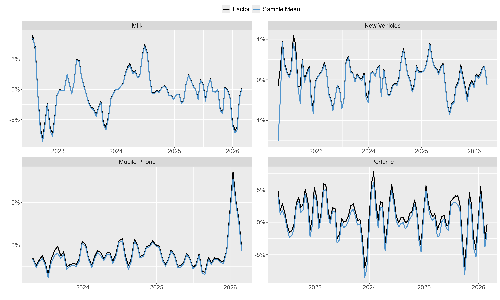
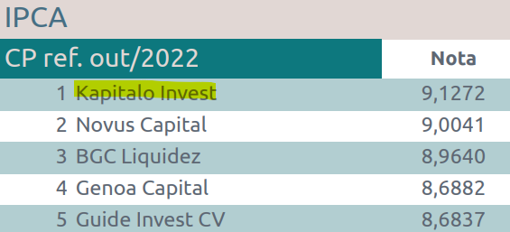
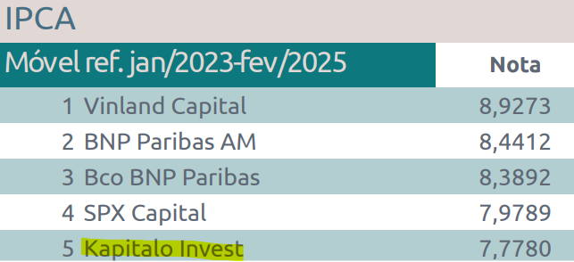

## Who am I?

- Economist working at the intersection of applied macroeconomics, data science, and research engineering

- Lead of Data and Economic Modeling at Kapitalo, a Brazilian multi-manager hedge fund managing over USD 5 billion in assets

- I develop quantitative models, data products, and data pipelines for investment research

- Much of my recent work has focused on inflation nowcasting using alternative data

::: notes
We started using alternative data as of the onset of COVID back in 2020 to track the current state of the economy.
Many of these indicators became less useful as the economy estabilized, but others remained useful.
For example prices from web to track inflation.
:::

## Why Inflation Nowcasting?
### Predicting inflation in Brazil is a highly competitive task

- Inflation expectations are central to asset allocation in Brazil

- A deep and liquid market for inflation-linked bonds creates strong incentives to improve predictive accuracy

- Professional forecasters rely on a wide range of high-frequency information

  - These include commodity prices, exchange rates, wholesale prices, among many others

  - One of the most valuable information sources is the *FGV Monitor*, a proprietary daily indicator based on brick-and-mortar price collection
  
  - By closely following the methodology of Brazil’s official statistical agency, it provides an early signal of short-term inflation dynamics

## The FGV Monitor Leaves Room for Improvement
### It is hard to beat for some components, but less informative for others

{fig-align="center"}

::: notes
The FGV Monitor covers each of the more than 300 items in Brazilian CPI indicator.
Throughtout the presentation, I'll be considering only a handfull of them.
Many of them weights heavily on the aggregate CPI either because of its large weight on the basket or because of its high volatility. Perfume is an example of both causes.
Nevertheless, althought still preliminary, the results here apply to most of the examples I've worked on so far.
:::

## Where Can Additional Information Come From?
### Building an additional high-frequency signal from web-scraped prices

- Rather than replacing the FGV Monitor, we seek an additional source of high-frequency information based on web-scraped prices

- The greatest potential lies in components where the FGV Monitor is less informative

- Recent advances in computational tools have made collecting web prices substantially more accessible

- Even when starting from similar raw data, the resulting indicators can differ because of coverage, preprocessing, classification, and modeling choices

::: {.text-highlight .fragment}
The challenge is no longer access to data, but transforming it into useful signals.
:::

::: notes
This is an appealing feature of indicators built from alternative data. As a matter of fact, we've been putting a massive amount of effort in improving these preprocessing steps, especially the classification step.
Besides fine tuning the rules that controls how products are classified, we are also testing with LLM's whenever ambiguity remains.
:::

## The First Challenge
### Which products should we use?

- We observe hundreds, sometimes thousands, of products with daily price updates

- The available product universe is far larger than the official CPI basket

- The official CPI basket is expected to be embedded within this larger universe

::: {.text-highlight .fragment}
This looks like a standard variable selection problem, right?
:::

## Not Quite a Selection Problem
### The predictor set evolves continuously

- Products continuously enter and leave the basket

  - Electronics have short lifecycles and are constantly replaced

  - Vehicles are effectively a new basket every year

  - Even "stable" categories exhibit gradual turnover

::: {.text-highlight .fragment} 
Product turnover makes the set of available products generally unstable over time
:::

::: notes
Sometimes, the turnover reflects methodological aspects, such as how the official statistical agency builds their datasets.
Sometimes, howerver, it's a matter of the circumstances as old-fashioned products are being replaced by new ones. 
:::

## What Does Turnover Look Like?
### Product availability is highly dynamic over time

{fig-align="center"}

::: notes
Turnover may arise because of many things, either because: 
- New products are released, or
- Products that are a limited edition, or
- Products are not available at the website, or even
- Because failure in classification, due to typos or blank fields (missing features) when extracting data from websites
:::

## Why Do Standard Approaches Struggle?
### High turnover creates methodological and operational challenges

- Most methods are designed to learn stable relationships from a fixed set of predictors

- Many products have short lifecycles, leaving little time to estimate, validate, and re-optimize models before the underlying cross-section changes again

- In production environments, daily pipelines benefit from methods that remain stable over time rather than requiring frequent re-specification

::: {.text-highlight .fragment}  
The challenge is not only statistical, but also operational
:::

::: notes
Operational issues are so important here because we're running this analisys on a daily basis and for dozens of CPI itens.
Also, because we have to release these results just on time as market participants are reacting to news all the time -- in this case the FGV Monitor trigger market prices.
:::

## Reframing the Task
### From selecting products to aggregating information

- Variable selection relies on learning stable relationships over time

- Most products in our data have short and irregular histories

- Time dimension is scarce, but the cross-section is rich

::: {.text-highlight .fragment} 
Instead of selecting predictors, we exploit the information contained in the cross-section
:::

::: notes
At this point it's worth clarifying that what I'm actually seeking is a real-time indicator to track inflation. 
It means essentially an unsupervised summary of the cross-sectional data. 
This indicator will serve as an additional input to the final forecast which includes other indicators and, surely, judgement. 
:::

## A Simple Benchmark
### Despite its simplicity, the mean captures a useful amount of information

{fig-align="center"}

::: notes
This is sometimes an underrated result in this context, since it enables us to extract valuable information from a very simple and easy to compute method.
Indeed, we've successfully been employing simple average in this context for a couple of years.
But as we can see, this works extremely well for some itens while not so well for others.
The question is, therefore, whether we can improve on these more challenging items.
:::

## A Structured Approach
### From a Mean to a Factor Model

- The mean already captures a useful amount of information

- Rather than replacing it, we can view it as a restricted factor model

- This perspective suggests a natural path for introducing additional structure

::: {.text-highlight .fragment} 
A factor model allows us to extend the mean while preserving its intuition
:::

::: notes
I believe that the usefulness of this framework is that it allows us to assess several assumptions by simply making small tweaks,
rather that trying different things out with varying levels of discretionarity.
:::

## The Mean as the Simplest Factor Model {auto-animate="true" auto-animate-easing="easy-in-out"}
### A single latent factor under strong restrictions

::: {.nonincremental}
- Unit loadings, no factor dynamics, and homoskedastic Gaussian errors
:::

::: {data-id="mean-factor-equations" auto-animate-delay="0.2"}
$$
\require{cancel}
\begin{aligned}
y_{i,t} &= f_t + \varepsilon_{i,t} \\
f_t &= \eta_t \\
\varepsilon_{i,t} &\sim {\mathcal{N}}(0, {\sigma_\varepsilon}) \\
\eta_t &\sim \mathcal{N}(0, \sigma_\eta)
\end{aligned}
$$
:::

## The Mean as the Simplest Factor Model {auto-animate="true" auto-animate-easing="easy-in-out"}
### A single latent factor under strong restrictions

::: {.nonincremental}
- Unit loadings, no factor dynamics, and homoskedastic Gaussian errors
:::

::: {.columns}

::: {.column width="30%"}
::: {data-id="mean-factor-equations"}
$$
\require{cancel}
\begin{aligned}
y_{i,t} &= f_t + \varepsilon_{i,t} \\
f_t &= \eta_t \\
\varepsilon_{i,t} &\sim {\mathcal{N}}(0, {\sigma_\varepsilon}) \\
\eta_t &\sim \mathcal{N}(0, \sigma_\eta)
\end{aligned}
$$
:::
:::

::: {.column width="70%"}

:::

:::

::: notes
They are not exactly the same, there are some differences. I will not, however, dive into the differences.
What is most important here is that this framework delivers results that are very similar to the sample mean,
and then can serve as a useful starting point to achieve better results than our current baseline.
:::

## The Mean as the Simplest Factor Model {auto-animate="true" auto-animate-easing="easy-in-out"}
### A single latent factor under strong restrictions

::: {.nonincremental}
- Unit loadings, no factor dynamics, and homoskedastic Gaussian errors
:::

::: {.columns}

::: {.column width="50%"}
::: {data-id="mean-factor-equations"}
$$
\require{cancel}
\begin{aligned}
y_{i,t} &= f_t + \varepsilon_{i,t} \\
f_t &= \eta_t \\
\varepsilon_{i,t} &\sim {\mathcal{N}}(0, {\sigma_\varepsilon}) \\
\eta_t &\sim \mathcal{N}(0, \sigma_\eta)
\end{aligned}
$$
:::
:::

::: {.column width="50%"}

:::

:::

::: {.text-highlight} 
This naturally leads to potential extensions
:::

::: notes
In the next slides I'll be relaxing some of these assumptions, namely the lack of temporal dynamics and the shape of the distribution of the observation error term.
I will not, however, relax the unit loading assumption because of the turnover nature of the dataset and, of course, it's high dimensionality.
:::

## Extension 1: Factor Dynamics {auto-animate="true"}
###  Allow the latent signal to evolve over time 

$$
\require{cancel}
\begin{aligned}
y_{i,t} &=  f_t + \varepsilon_{i,t} \\
f_t &= \color{#D97706}{f_{t-1}} + \eta_t \\
\varepsilon_{i,t} &\sim \mathcal{N}(0, {\sigma_\varepsilon}) \\
\eta_t &\sim \mathcal{N}(0, \sigma_\eta)
\end{aligned}
$$

## Extension 1: Factor Dynamics {auto-animate="true"}
###  Allow the latent signal to evolve over time 

{fig-align="center"}

::: notes
No noticeable difference here. I was expecting a different result, and my best guess on this is that, since prices are correlated over time the cross-section at time t already captures the dynamics in the factor structure.
:::

## Extension 2: Time-Varying Volatility {auto-animate="true"}
###  Measurement uncertainty changes with cross-sectional dispersion 

$$
\require{cancel}
\begin{aligned}
y_{i,t} &=  f_t + \varepsilon_{i,t} \\
f_t &= \eta_t \\
\varepsilon_{i,t} &\sim \mathcal{N}(0, \color{#D97706}{\sigma_{\varepsilon,t}}) \\
\color{#D97706}{\log(\sigma_{\varepsilon,t})} &\color{#D97706}{=} \color{#D97706}{\alpha + \beta \times IQR_t} \\
\eta_t &\sim \mathcal{N}(0, \sigma_\eta)
\end{aligned}
$$

::: notes
This was motivated by an empirical finding that the forecast error from the indicator built from the simple avaerage was correlated with the cross-section dispersion.
So this was an attempt to address this empirical finding, to try to incorporate it into the model throught a scale effect on variance of the error term. 
:::

## Extension 2: Time-Varying Volatility {auto-animate="true"}
###  Measurement uncertainty changes with cross-sectional dispersion 

{fig-align="center"}

::: notes
Again, no noticeable effects. At least for the point estimation of the factor which is our interest here -- for now, and it's worth mentioning, I'm not particularly interested in the distribution of the forecasts.
:::

## Extension 3: Student-t Errors {auto-animate="true"}
###  Robustness to extreme product-level price changes 

$$
\require{cancel}
\begin{aligned}
y_{i,t} &= f_t + \varepsilon_{i,t} \\
f_t &= \eta_t \\
\varepsilon_{i,t} &\sim \color{#D97706}{t_\nu(0, \sigma_\varepsilon)} \\
\eta_t &\sim \mathcal{N}(0, \sigma_\eta)
\end{aligned}
$$

::: notes
This is the last feature I tried to explore, and as you might expect, this one delivered noticeable differences.
More especifically, by allowing heavy tails in the distribution of the error term, the resulting factor shows less sensitivity to large -- and not widespread -- prices changes.
:::

## Extension 3: Student-t Errors {auto-animate="true"}
###  Robustness to extreme product-level price changes 

{fig-align="center"}

::: notes
What's interesting here is that the resulting factor kept the hability to show large moviments when they're widespread.
This has allowed us to make risk considerations at important times, without discretionarity.
This is another important issue, as many of you might be wondering why not to use a trimmed mean, median, or some statistic like these.
Here we are making no discretionary choice over the sample. Not leaving aside any portion of the sample, just estimating the degree of freedom parameter (nu) 
:::

## Do Extensions Improve Forecasting Performance?
### Mean Absolute Error - Model with Student-t errors vs. sample mean

{fig-align="center"}

## Is there information beyond the FGV Monitor?
### Yes, there are periods when alternative data provides information beyond the FGV Monitor.

{fig-align="center"}

## What about combining them into a single indicator?
### Simple forecast combinations often outperform their individual components

{fig-align="center"}

## Business Impact
### Our forecasts have consistently ranked among the Brazilian Central Bank's Top 5
:::: {.columns}

::: {.column width="50%"}
{fig-align="center" width=90%}

{fig-align="center" width=90%}
:::

::: {.column width="50%"}
{fig-align="center" width=90%}

{fig-align="center" width=90%}
:::

::::

## Takeaways
### What we learned from high-turnover datasets

- In high-turnover datasets, variable selection is often not a viable strategy

- When predictors change faster than relationships can be learned, aggregation may be more effective than selection

- The cross-section contains valuable information beyond simple averaging

- Even simple extensions can deliver meaningful forecasting gains

- Alternative data are not silver bullets, but they can provide complementary information beyond traditional indicators

---

## THANK YOU!

:::: {.columns}

::: {.column width="45%"}

Contact

📧 <a href="mailto:joao@rleripio.com">joao@rleripio.com</a>  
🌐 <a href="https://www.rleripio.com" target="_blank">rleripio.com</a>    

:::

::: {.column width="55%"}

Slides

{width=55%}

:::

::::